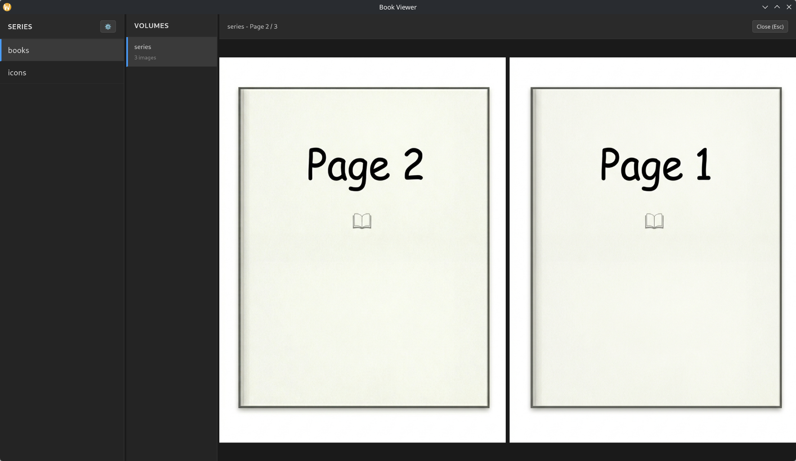

# Book Viewer



A book/manga viewer implemented with Go + Wails + React + TypeScript

Looking at existing image viewers and book viewers, I found that they either lack features I need or have too many unnecessary features with complicated settings.
This software simply displays files according to the local directory structure, providing only two-page spread view and zoom functionality.

I might want additional features in the future, but this is probably sufficient.

## Features

- **Series Panel**: Display series list
- **Volume Panel**: Display volumes of selected series
- **Viewer Panel**: Two-page spread view (right-to-left reading support)
- **Supported Formats**: ZIP (.zip, .cbz), RAR (.rar, .cbr), 7z (.7z, .cb7), directories
- **Nested Support**: Recognizes directory structure inside archives and displays hierarchically
- **Zoom Function**: Zoom in/out with mouse wheel, drag to move when zoomed (zoom level persists across pages)
- **Keyboard Controls**: Arrow keys for page navigation, Esc to close viewer
- **Settings**: Root directory selection and persistence
- **State Persistence**: Panel widths and root directory saved to localStorage

## Installation

### Pre-built Binaries

Download from Releases page.

### Build from Source

Requires [Wails](https://wails.io/) installation.

```bash
wails build
```

## Usage

1. After launch, click the ⚙️ icon in the SERIES panel to select root directory
2. Double-click on SERIES → Double-click on VOLUMES to open
3. Panel widths are adjustable by dragging (settings auto-saved)
4. In viewer, use arrow keys (↓/→) for next page, (↑/←) for previous page
5. Mouse wheel to zoom in/out, drag to move when zoomed

## Volume File Structure

Organize files in the following structure:

```text
/path/to/books/
├── SERIES-DIR/
│   ├── 01/
│   │   ├── 001.jpg
│   │   ├── 002.jpg
│   │   └── ...
│   ├── 02.zip
│   └── ...
└── ...
```

If an archive contains directories, each directory is recognized as a VOLUME.
